# Wedge

**Wedge**는 웹사이트의 사용 흐름을 직접 실행해보고, 사용자가 어디서 망설이거나 이탈할 수 있는지 evidence 기반으로 찾아주는 UX 진단 서비스입니다.

사용자는 먼저 분석하고 싶은 URL을 입력합니다. Wedge는 곧바로 정식 실행을 시작하지 않고, Site Discovery / Preflight로 첫 화면, 내비게이션, CTA, form, pricing/contact/checkout 진입점을 가볍게 확인한 뒤 해당 URL에 적합한 시나리오를 추천합니다. 사용자는 추천 시나리오를 선택하거나 guided custom scenario로 수정한 다음 정식 Run을 실행합니다.

```text
URL 입력
  → Site Discovery / Preflight
  → 추천 시나리오 확인
  → 사용자가 시나리오 선택 또는 수정
  → 실제 브라우저 Run 실행
  → 단계별 evidence 수집
  → 전환/UX 리스크 판단
  → 개선 제안 리포트
```

## 왜 필요한가요?

웹사이트의 문제는 단순히 “페이지가 예쁜가”로 결정되지 않습니다.

사용자는 첫 화면에서 계속 볼지 판단하고, CTA를 눌러도 될지 고민하고, 입력 폼에서 피로를 느끼고, 제출 직전에 신뢰할 수 있는지 다시 확인합니다. 이런 순간들은 정적 분석이나 단순 스크린샷만으로는 놓치기 쉽습니다.

Wedge는 실제 사용 흐름 속에서 다음 질문에 답하려고 합니다.

- 사용자가 첫 화면에서 가치를 바로 이해할 수 있는가?
- 다음 행동이 명확하게 보이는가?
- 입력 과정에서 불필요한 부담이나 오류가 있는가?
- 제출/가입/문의 직전에 충분한 신뢰를 주는가?
- 기술적 오류가 전환 흐름을 방해하지 않는가?

## Wedge가 하는 일

### 1. URL-first Site Discovery

사용자가 URL을 입력하면 Wedge는 전체 분석 전에 짧은 Discovery를 실행합니다. Discovery는 first view, header/nav, CTA 후보, form 후보, pricing/contact/signup/checkout 진입점을 확인해 `LANDING_CTA`, `SIGNUP_LEAD_FORM`, `PRICING`, `PURCHASE_CHECKOUT`, `CONTACT`, `CONTENT_ONLY` 같은 시나리오 후보를 추천합니다.

### 2. 실제 사용자 흐름 실행

단순히 HTML을 읽는 것이 아니라, 브라우저에서 사용자의 행동을 재현합니다. 랜딩 페이지 확인, CTA 클릭, 회원가입 폼 입력, 가격 페이지 탐색처럼 실제 전환 흐름에 가까운 시나리오를 실행합니다. 정식 Run은 Discovery 결과나 사용자의 직접 선택을 바탕으로 생성됩니다.

### 3. 단계별 evidence 수집

각 행동 이후의 화면과 상태를 checkpoint로 남깁니다. 문제가 발생한 순간을 근거와 함께 연결하기 때문에, “왜 문제인지”를 설명할 수 있습니다.

### 4. UX/전환 리스크 판단

Wedge는 수집한 evidence를 바탕으로 명확성, 행동 경로, 마찰, 신뢰, 안정성, 시각적 위계 같은 관점에서 리스크를 판단합니다.

### 5. 개선 제안 리포트 제공

사용자가 바로 이해할 수 있도록 핵심 문제, 근거, 영향, 개선 방향을 리포트로 정리합니다. 단순 점수보다 “어느 순간에 왜 막히는지”를 보여주는 것이 목표입니다.

## 주요 사용 사례

- 랜딩 페이지의 첫인상과 CTA 흐름 점검
- 회원가입/문의/리드 폼의 이탈 요인 확인
- 가격 페이지나 결제 직전 화면의 신뢰 요소 점검
- 모바일 화면에서 버튼 크기, 가독성, 전환 흐름 확인
- 배포 전 핵심 전환 시나리오 QA
- 개선 전/후 리포트를 비교하며 UX 변경 효과 확인

## 우리가 중요하게 보는 것

- **URL-first guidance**: 사용자가 어떤 시나리오를 선택해야 할지 모를 때 Wedge가 먼저 가능한 흐름을 추천합니다.
- **실제 흐름**: 페이지 하나가 아니라 사용자의 행동 흐름을 봅니다.
- **근거 기반 판단**: 모든 지적은 수집된 evidence와 연결되어야 합니다.
- **재현 가능성**: 같은 시나리오를 다시 실행해 비교할 수 있어야 합니다.
- **설명 가능한 리포트**: 막연한 평가가 아니라 행동 리스크와 개선 방향을 제시합니다.
- **작은 팀도 쓸 수 있는 UX 진단**: 전문 리서치 리소스가 부족해도 핵심 전환 문제를 빠르게 확인할 수 있게 합니다.

## 서비스 화면

<table>
  <tr>
    <td align="center">
      <strong>URL 입력</strong><br />
      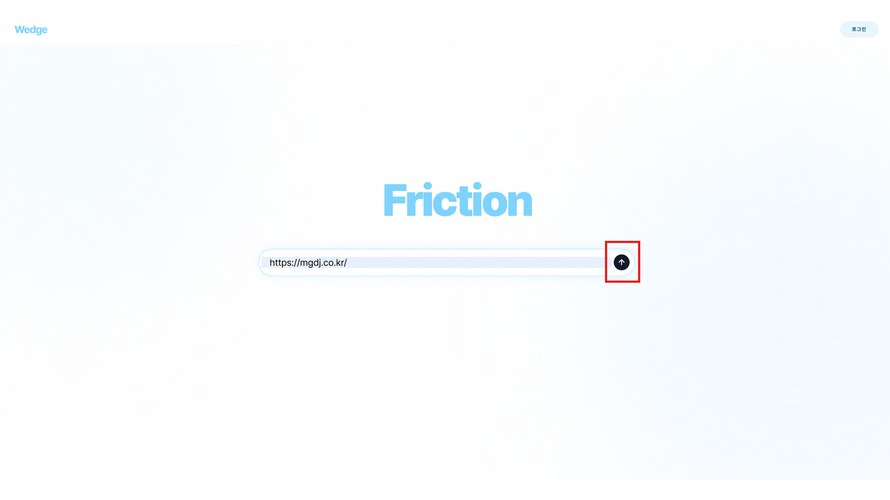
    </td>
  </tr>
  <tr>
    <td align="center">
      <strong>추천 시나리오</strong><br />
      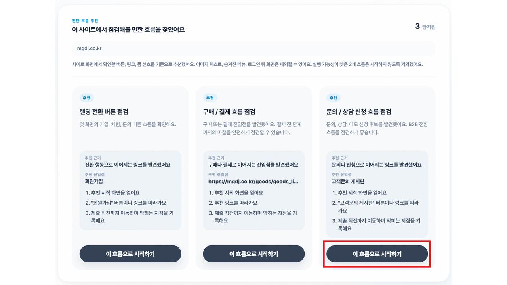
    </td>
  </tr>
  <tr>
    <td align="center">
      <strong>실시간 실행</strong><br />
      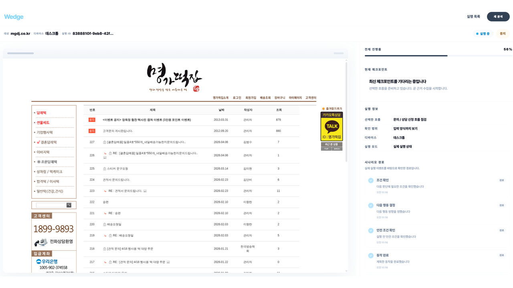
    </td>
  </tr>
  <tr>
    <td align="center">
      <strong>실행 목록</strong><br />
      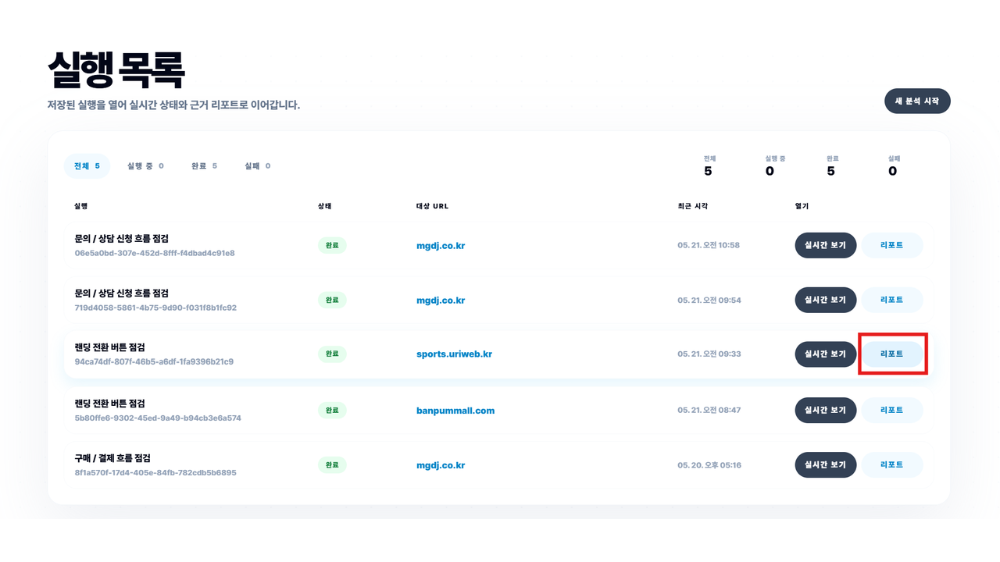
    </td>
  </tr>
  <tr>
    <td align="center">
      <strong>리포트 근거</strong><br />
      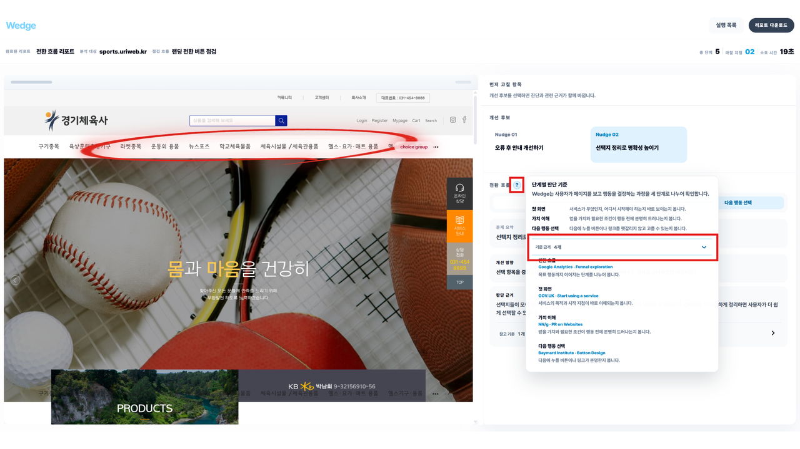
    </td>
  </tr>
  <tr>
    <td align="center">
      <strong>PDF/MD 내보내기</strong><br />
      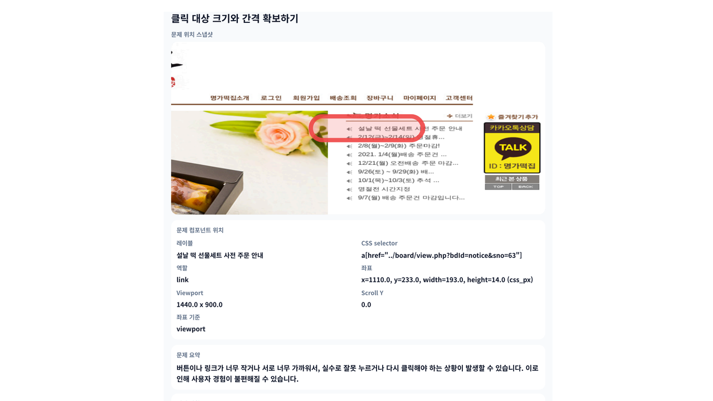
    </td>
  </tr>
</table>

전체 시연 흐름은 [exec/demo-scenario-compact.md](exec/demo-scenario-compact.md)에 정리되어 있습니다.

## 아키텍처

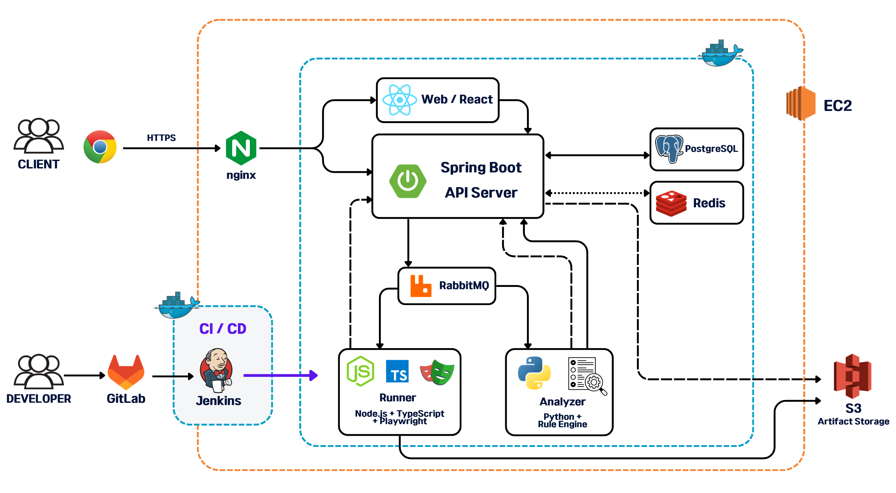

Wedge는 React Client, Spring API Server, Node Playwright Runner, FastAPI Analyzer를 분리합니다. React는 Runner/Analyzer와 직접 통신하지 않고 Spring API Server를 통해 상태를 조회합니다. Spring은 PostgreSQL에 canonical 상태를 저장하고, RabbitMQ로 장시간 작업을 분배하며, Runner와 Analyzer는 internal callback으로 결과를 돌려줍니다.

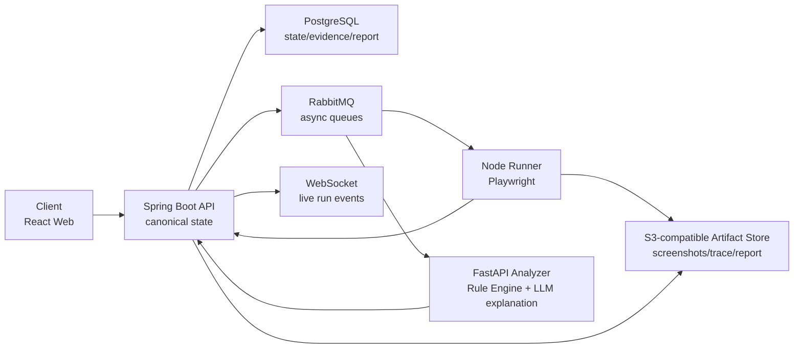

### 실행 흐름

```text
URL 입력
  -> Site Discovery / Preflight
  -> Scenario Recommendation
  -> Scenario Authoring / 사용자 확정
  -> Browser Run / Agent Run
  -> Checkpoint / Observation / Artifact 수집
  -> EvidencePacket 생성
  -> Analyzer Rule Engine + LLM explanation
  -> Report / Share / Export
```

## 기술 스택

| 구분 | 기술 |
| --- | --- |
| API Server | Java 17, Spring Boot 3.5.14, Spring Security, Spring AMQP, Spring Data Redis, MyBatis, Springdoc OpenAPI, Spring AI MCP Server |
| Database/Queue/Cache | PostgreSQL 17, RabbitMQ 4.2, Redis 8.6 |
| Artifact Storage | S3-compatible object storage, local filesystem fallback, MinIO for dev |
| Runner | Node.js 24+, TypeScript, Playwright, AMQP, AWS SDK S3, Prometheus client |
| Analyzer | Python 3.11+, FastAPI, Uvicorn, Pydantic, Rule Engine, GMS/LLM explanation path |
| Web | React 18, TypeScript 5.6, Vite 7, feature/page/entity/shared 구조 |
| Infra/DevOps | Docker Compose, Nginx, Jenkins, Flyway, Prometheus, DuckDNS/Let's Encrypt 운영 구성 |

## 프로젝트 구조

```text
.
├── apps
│   ├── api-server      # Spring Boot REST/Internal/MCP API, DB state owner
│   ├── web             # React 사용자 웹 앱
│   ├── runner          # Node/TypeScript Playwright 실행 worker
│   └── analyzer        # Python/FastAPI 분석 worker
├── packages/contracts  # OpenAPI, MQ schema, payload examples, shared contracts
├── docs                # 제품/아키텍처/API/DB/Judge/운영 문서
├── infra               # DB migrations, Nginx, RabbitMQ, Jenkins, scripts, monitoring
├── exec                # 제출/시연 문서, 서비스 이미지, DB dump
├── compose.dev.yaml
├── compose.prod.yaml
└── Jenkinsfile
```

## 구현 범위

현재 저장소에는 URL-first 진단 플로우를 실제로 연결하기 위한 주요 모듈이 포함되어 있습니다.

- 인증/세션: email/password 기반 signup/login/refresh/logout, JWT access token, refresh cookie
- 프로젝트 기본값: smoke와 demo 실행을 위한 workspace/project bootstrap
- Discovery: URL 사전 탐색 요청, Runner callback, 추천 시나리오 저장
- Scenario Authoring: Discovery recommendation과 Run materialization 사이의 후보 생성/확정 경계
- Run: scripted run과 Agent run 시작/중지, lifecycle 상태, step/event/live 조회
- Evidence: checkpoint, observation, artifact, EvidencePacket 저장과 signed URL 생성
- Analysis: evidence 기반 analysis job 생성, rule hit, finding, nudge 저장
- Report: report summary/detail/share/export, PDF renderer 연동
- Runner: Playwright 실행, Agent trace, idempotent execution, artifact 저장
- Analyzer: Rule Engine, stage context, GMS 기반 설명/라벨링 확장 경로
- Reliability: outbox, processed message, runner/agent idempotency, DLQ/worker 운영 경계

## API와 계약

Wedge는 contract-first monorepo입니다. 사람이 읽는 기준 문서는 `docs/`, machine-readable 계약은 `packages/contracts/` 아래에 둡니다.

| 계약 | 위치 |
| --- | --- |
| REST/OpenAPI | [packages/contracts/openapi/wedge_openapi.yaml](packages/contracts/openapi/wedge_openapi.yaml) |
| Public/Internal API 설명 | [docs/03_api_reference.md](docs/03_api_reference.md) |
| Domain payload | [docs/04_domain_payload_contracts.md](docs/04_domain_payload_contracts.md) |
| MQ message schema | [packages/contracts/mq](packages/contracts/mq) |
| Example payload | [packages/contracts/examples](packages/contracts/examples) |

Public REST는 `/api`, internal callback은 `/internal`, WebSocket은 `/ws`, MCP adapter는 `/mcp` base path를 사용합니다. Public success response는 `data` + `meta`, error response는 `error` + `meta` envelope를 사용합니다.

## DB 구조 요약

DB 기준은 [docs/wedge_schema.sql](docs/wedge_schema.sql)입니다. 운영/개발 DB 마이그레이션은 [infra/db/migrations](infra/db/migrations)에 있고, 제출용 sanitized dump는 [exec/db-dumps/wedge_dev_sanitized_20260521_114009.sql](exec/db-dumps/wedge_dev_sanitized_20260521_114009.sql)에 있습니다.

### 전체 흐름

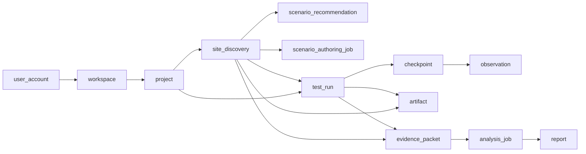

| 그룹 | 핵심 테이블 | 역할 |
| --- | --- | --- |
| 계정/프로젝트 | `user_account`, `workspace`, `workspace_member`, `project`, `project_member` | 사용자와 분석 대상 프로젝트 권한 |
| 시나리오 | `scenario_template`, `scenario_template_version`, `rule_registry` | 실행 템플릿과 rule set 버전 |
| Discovery/Run | `site_discovery`, `scenario_recommendation`, `scenario_authoring_job`, `test_run`, `test_run_step`, `test_run_event` | URL 탐색, 추천, 실행 lifecycle |
| Evidence | `checkpoint`, `observation`, `artifact`, `evidence_packet` | 단계별 화면/DOM/AX/trace와 normalized fact |
| Analysis/Report | `analysis_job`, `rule_hit`, `analysis_finding`, `nudge`, `report`, `report_share` | Judge 결과, 사용자-facing finding, 공유 리포트 |
| Agent/MCP/운영 | `runner_agent_event`, `runner_agent_trace`, `agent_client_policy`, `mcp_invocation_log`, `outbox_message`, `processed_message`, `worker_instance` | Agent 실행, MCP 감사, MQ 신뢰성 |

### 계정/프로젝트

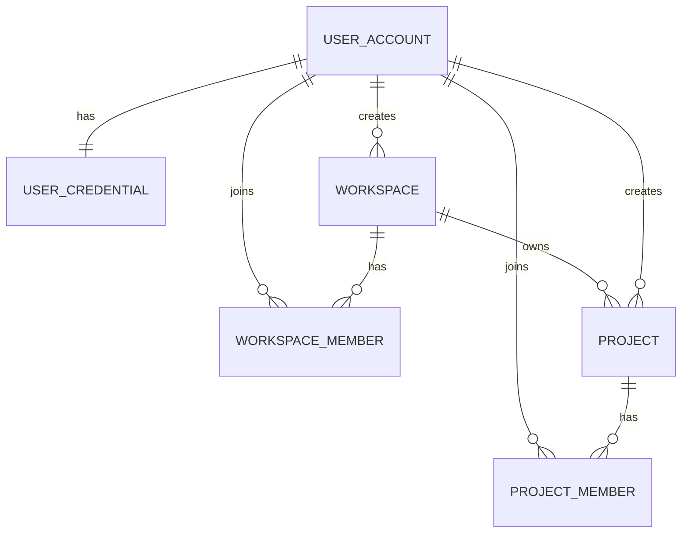

### Discovery/Scenario/Run

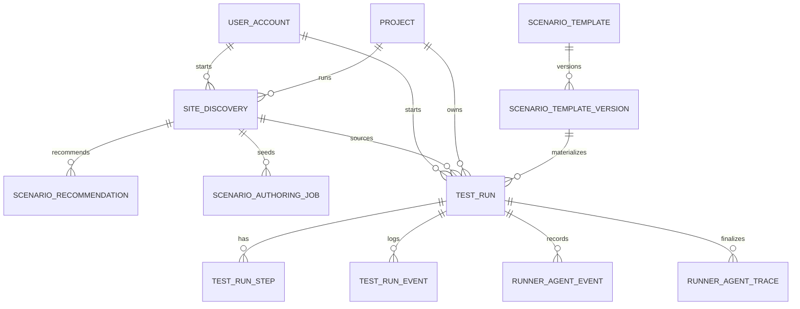

### Evidence/Analysis/Report

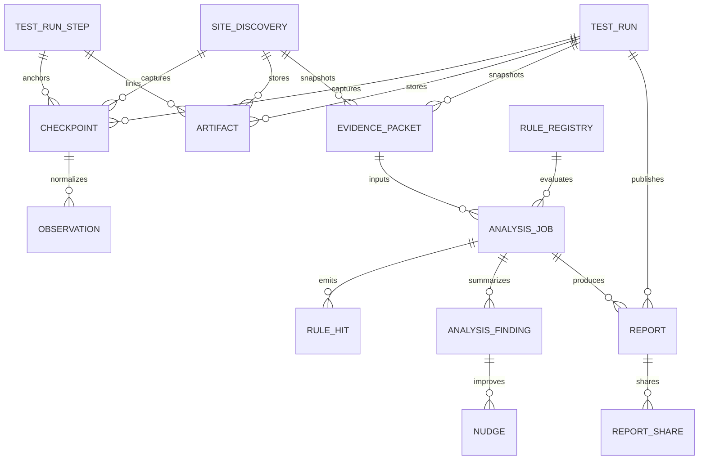

### 운영 신뢰성

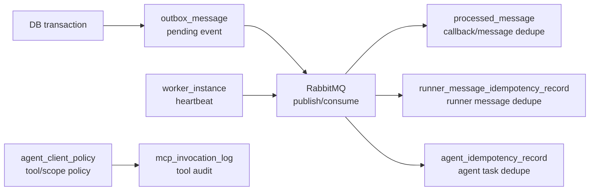

`outbox_message`, `processed_message`, `runner_message_idempotency_record`, `worker_instance`는 물리 FK보다 운영 안정성/중복 처리 목적의 테이블입니다. 운영 신뢰성 다이어그램은 물리 ERD가 아니라 메시지 발행, 중복 처리, audit 흐름 요약입니다.


## 로컬 MVP smoke 점검

Runner/Analyzer까지 연결된 최소 MVP 플로우를 확인할 때는 Swagger에서 internal callback payload를 직접 입력하지 말고, public Run API가 MQ를 발행하고 Runner/Analyzer가 callback을 보내는 경로를 사용한다.

1. 개발 인프라 실행

```bash
docker compose -f compose.dev.yaml up -d postgres rabbitmq redis minio runner analyzer-worker
```

2. 기존 dev DB가 오래된 상태라면 checked-in migration을 먼저 적용한다.

```bash
node infra/scripts/apply-dev-db-migrations.mjs
```

기본 DB 컨테이너 이름은 `wedge-postgres-dev`다. 다른 컨테이너를 쓰는 경우 예를 들어:

```bash
WEDGE_DEV_DB_CONTAINER=wedge-dev-postgres-alt node infra/scripts/apply-dev-db-migrations.mjs
```

3. smoke project/scenario seed를 넣는다. 이 스크립트는 `e2e-smoke@wedge.local` 사용자가 이미 존재하면 `workspace_member`와 `project_member`도 함께 보정한다.

```bash
node infra/scripts/seed-real-run-smoke.mjs
```

4. API 서버를 실행한다. 기본 개발 모드는 IntelliJ 또는 로컬 Gradle 실행이다.

```bash
cd apps/api-server && gradle bootRun
```

WSL/Codex에서 전체 컨테이너 기반 검증이 필요하면 API 서버도 Docker Compose profile로 실행할 수 있다.

```bash
RUNNER_CALLBACK_BASE_URL=http://api-server:8080 \
ANALYZER_CALLBACK_BASE_URL=http://api-server:8080 \
ANALYZER_EVIDENCE_BASE_URL=http://api-server:8080 \
docker compose --env-file .env -f compose.dev.yaml --profile api up -d
```

이 모드는 Runner/Analyzer 컨테이너가 `http://api-server:8080`으로 callback을 보낼 수 있게 API 서버를 같은 Compose 네트워크에 올린다. IntelliJ로 API 서버를 실행하는 경우에는 기존처럼 `RUNNER_CALLBACK_BASE_URL=http://host.docker.internal:8080` 경로를 사용한다.

웹까지 포함해 전체를 Docker Compose 안에서 확인하려면 `web` profile을 함께 켠다.

```bash
RUNNER_CALLBACK_BASE_URL=http://api-server:8080 \
ANALYZER_CALLBACK_BASE_URL=http://api-server:8080 \
ANALYZER_EVIDENCE_BASE_URL=http://api-server:8080 \
docker compose --env-file .env -f compose.dev.yaml --profile api --profile web up -d
```

이 모드에서는 `http://localhost:5173`으로 Web 컨테이너에 접속한다. Web 컨테이너의 dev Nginx 설정은 `/api/*` 요청을 같은 Compose 네트워크의 `api-server:8080`으로 프록시한다.

5. 전체 Run smoke를 실행한다.

```bash
node infra/scripts/real-run-e2e-smoke.mjs
```

성공 기준은 Run `COMPLETED`, EvidencePacket checkpoint/artifact 생성, 필요 시 `/api/runs/{runId}/analysis` 이후 `analysisStatus=COMPLETED`, `/api/runs/{runId}/report`의 `status=READY`다.

6. Runner Agent 경로까지 확인하려면 Agent smoke를 실행한다.

```bash
node infra/scripts/real-agent-run-e2e-smoke.mjs
```

이 스크립트는 별도 target URL이 없으면 로컬 fixture site를 띄우고 `http://host.docker.internal:{port}/`를 Agent 시작 URL로 사용한다. Docker Desktop이 아닌 환경에서는 `WEDGE_AGENT_SMOKE_TARGET_URL` 또는 `WEDGE_AGENT_SMOKE_FIXTURE_PUBLIC_HOST`를 Runner 컨테이너에서 접근 가능한 주소로 지정한다.

성공 기준은 Agent run `STOPPED`, `AgentTrace.final_outcome=SUCCESS_CHECKOUT_ENTRY_REACHED`, TRACE artifact 저장, 그리고 기본값 기준 두 번째 run에서 `planner_source=replay_hint` decision이 1개 이상 확인되는 것이다. replay 검증만 끄려면 `WEDGE_AGENT_SMOKE_VERIFY_REPLAY=false`를 사용한다.

## 핵심 용어

- **Site Discovery**: URL을 가볍게 탐색해 가능한 시나리오를 추천하는 사전 단계입니다.
- **Preflight**: Site Discovery와 같은 의미로 UI/프로세스에서 사용할 수 있는 표현입니다.
- **Scenario Recommendation**: 발견된 CTA/form/pricing/checkout/contact 후보를 바탕으로 추천한 분석 시나리오입니다.
- **Scenario Fit Status**: 선택한 시나리오가 해당 URL에서 실행 가능한지 나타내는 상태입니다.
- **Scenario Mismatch Report**: 선택한 시나리오가 URL에 맞지 않을 때 생성하는 불일치 리포트입니다. 이는 시스템 실패나 UX 결함 판정이 아니라 URL과 시나리오의 적용 가능성 결과입니다.

## 문서 읽는 순서

1. `docs/00_master_decisions.md` — 제품/기술 결정 기준
2. `docs/01_architecture_and_project_structure.md` — Discovery를 포함한 서비스 구조
3. `docs/03_api_reference.md` — Discovery와 Run API 흐름
4. `docs/04_domain_payload_contracts.md` — SiteDiscoveryResult, ScenarioPlan, EvidencePacket 계약
5. `packages/contracts/openapi/wedge_openapi.yaml` — machine-readable REST 계약
