# Wedge 서비스 시연 시나리오

## 사전 작업

- 임의 사이트 리포트까지 미리 진행해 둡니다.
- 사전 준비 사이트: <https://sports.uriweb.kr/>
- 시연 서비스: <https://wedge-app.duckdns.org/>
- 시연 대상 사이트: <https://mgdj.co.kr/>

---

## 1. 분석 주소 입력 및 분석 시작

시연 서비스에 접속한 뒤 분석 대상 주소를 입력하고, 분석 화살표 버튼을 눌러 분석을 시작합니다.

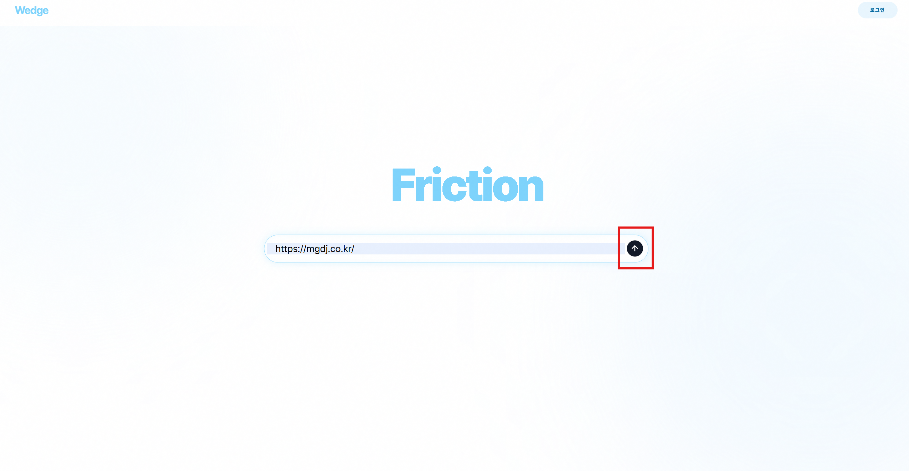

---

## 2. 사전 탐색 대기 화면 확인

사전 탐색이 진행되는 동안 약 15초 정도 대기하며, 현재 서비스가 대상 사이트를 탐색하고 있음을 확인합니다.

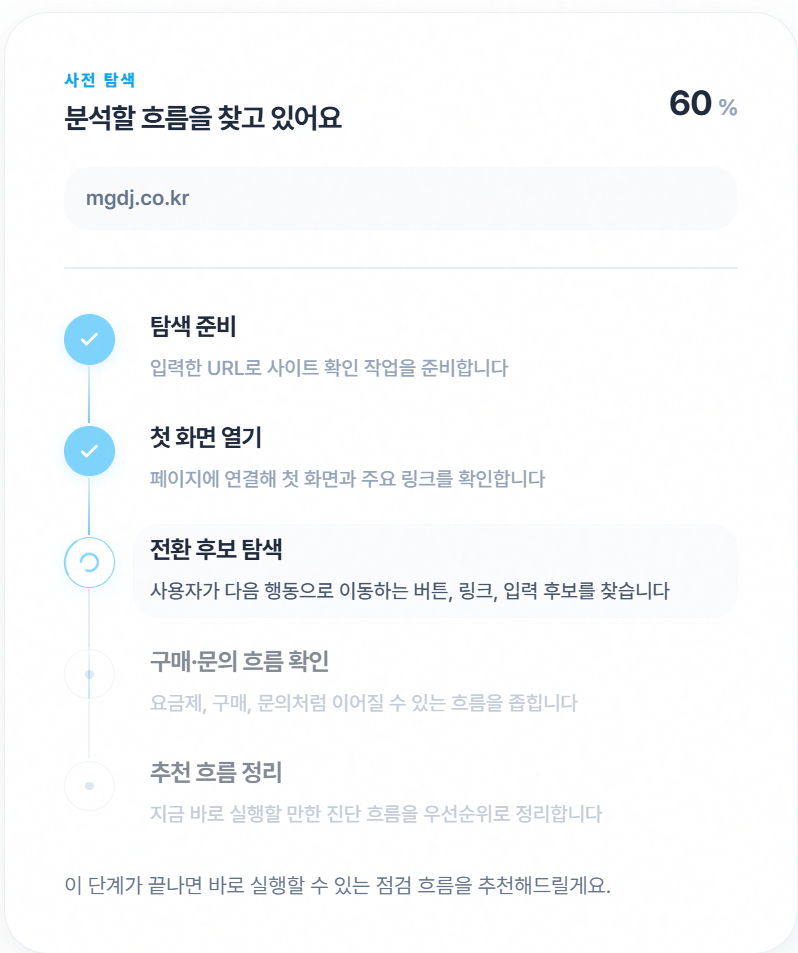

---

## 3. 추천 시나리오 확인 및 문의 시나리오 선택

추천 시나리오 흐름을 간략히 확인한 뒤, 문의 시나리오를 선택합니다.

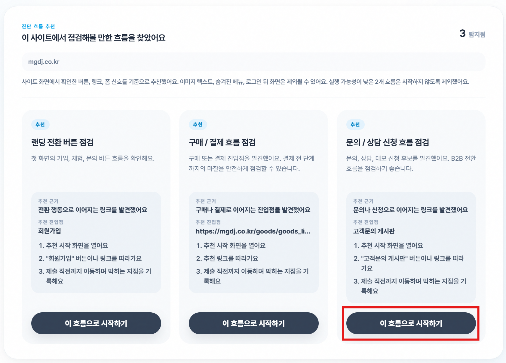

---

## 4. 시뮬레이터 진행 화면 확인

시뮬레이터가 진행되는 동안 화면에 표시되는 실시간 로그와 캡처 화면을 확인합니다.

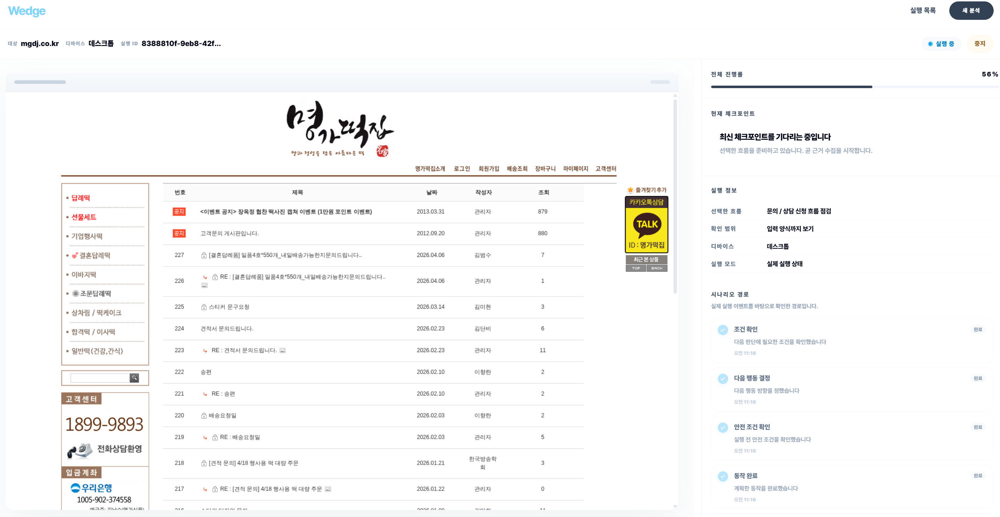

---

## 5. 분석 및 리포트 대기 중 이전 리포트 확인

시뮬레이터 완료 후 분석과 리포트 생성이 진행되는 동안, 실행 목록에서 이전 리포트로 이동합니다.

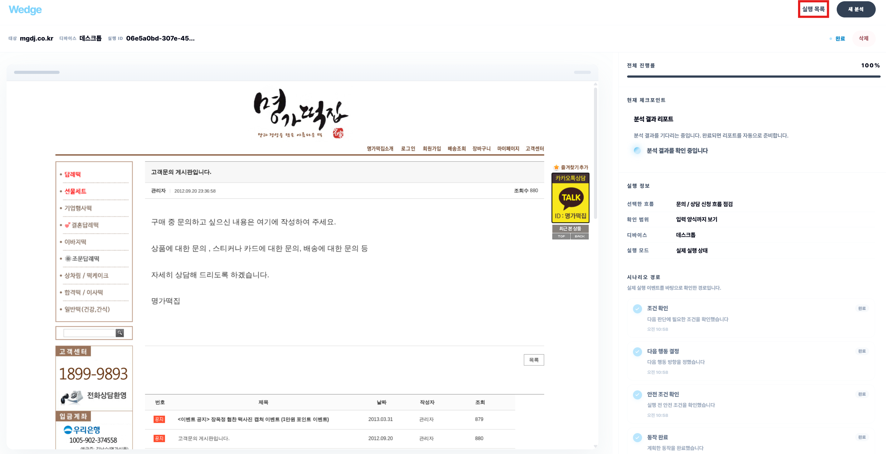

실행 목록에서 리포트를 선택해 기존 리포트 화면으로 바로 이동합니다.

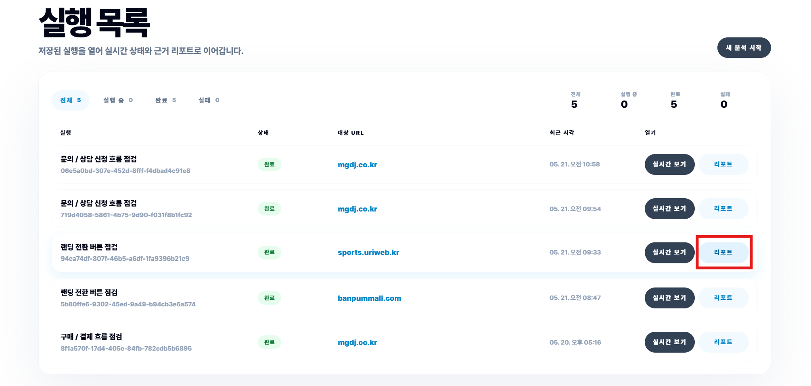

---

## 6. 리포트 내 툴팁, 판단 근거, 출처 사이트 확인

리포트 화면에서 툴팁 버튼을 눌러 설명을 확인하고, 판단 근거와 출처 사이트를 차례로 확인합니다.

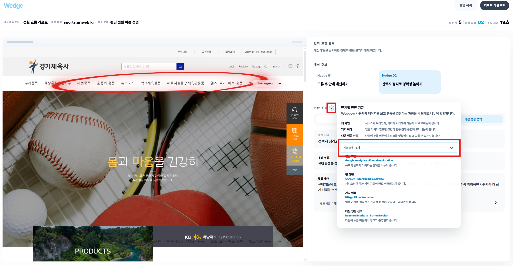

---

## 7. 실행 목록에서 실시간 보기로 이동

다시 실행 목록으로 이동한 뒤, 진행 중인 실행의 실시간 보기를 선택합니다.

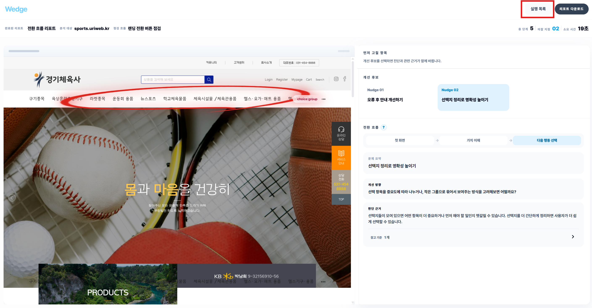

실시간 보기 화면에서 현재 분석 진행 상태를 확인합니다.

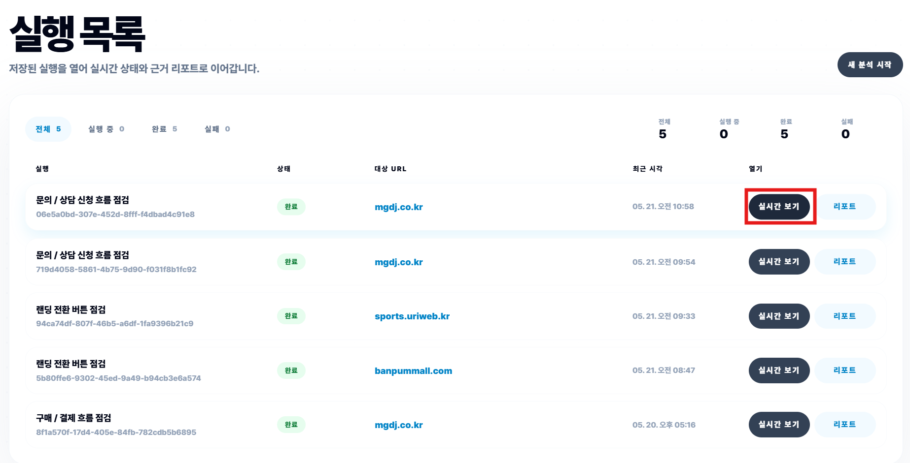

---

## 8. 리포트 완료 후 수집 자료 확인 및 리포트 열기

리포트가 완료되면, 리포트를 열기 전에 어떤 자료가 수집되었는지 확인합니다. 이후 리포트 열기를 선택합니다.

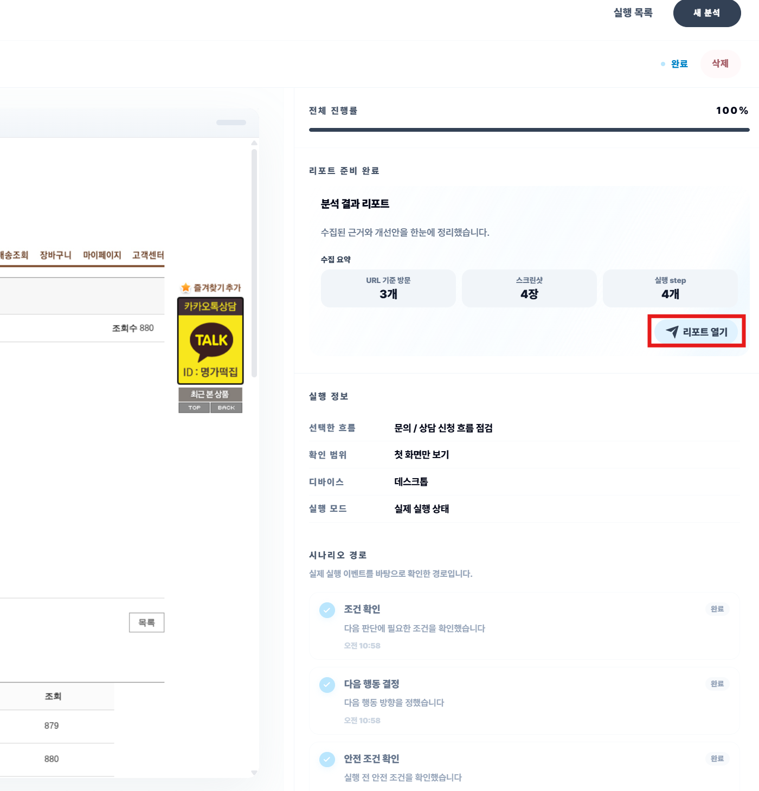

---

## 9. PDF 다운로드 및 리포트 화면 확인

리포트 화면에서 PDF 다운로드를 선택한 뒤, 리포트 화면 구성을 확인합니다.

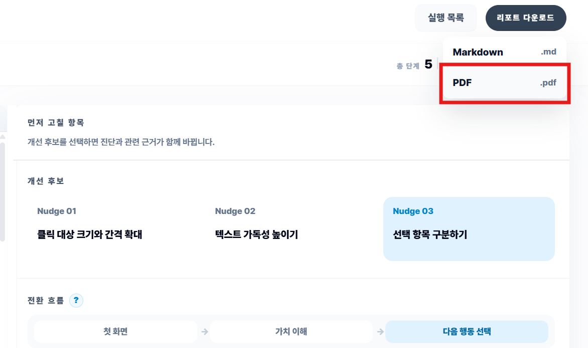

---

## 10. PDF 열기 및 CSS selector / 좌표 정보 확인

다운로드한 PDF를 열고, 리포트 안에 포함된 CSS selector와 좌표 정보가 어떤 의도로 제공되는지 확인합니다.

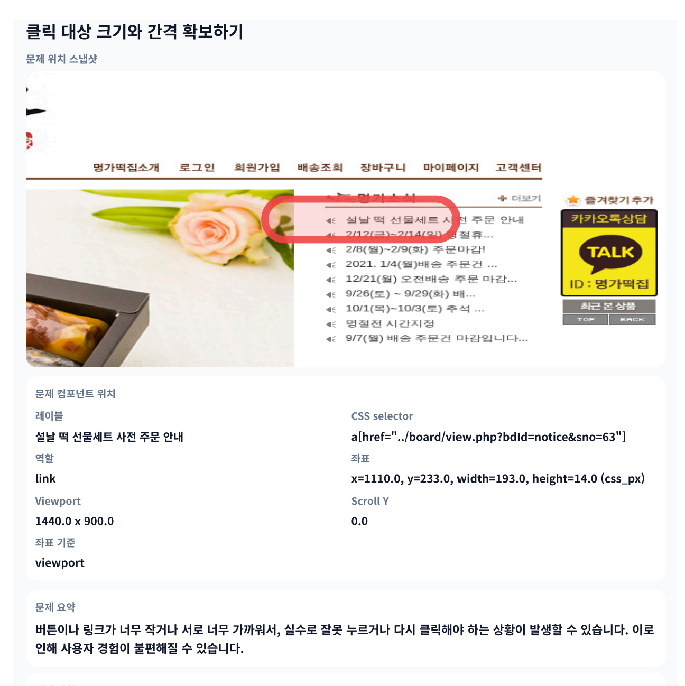

---

## 11. MD 다운로드 기능 확인

다시 리포트 화면으로 돌아와 MD 다운로드 기능의 역할을 확인합니다.

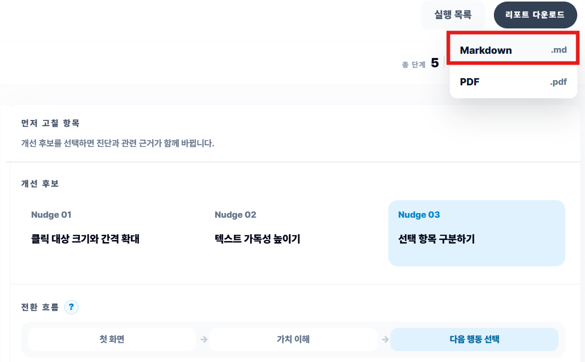

---

## 12. PPT로 전환

서비스 시연을 마무리한 뒤 PPT 화면으로 다시 전환합니다.

